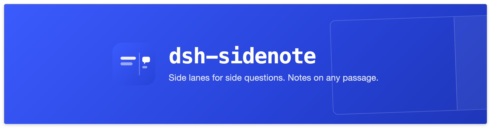
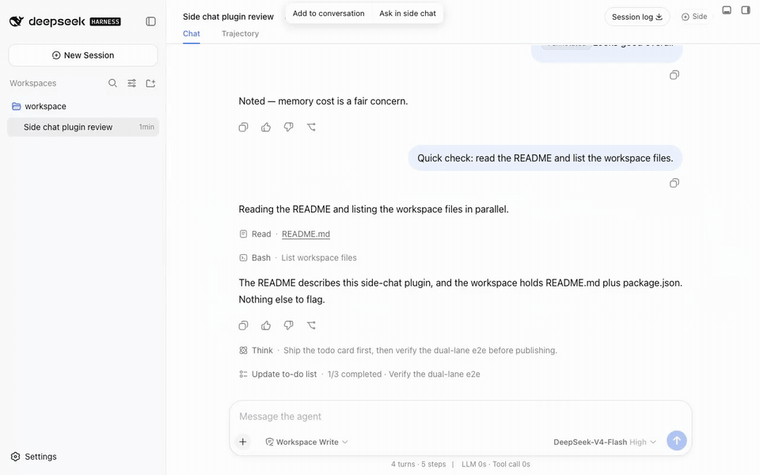

<p align="center">
  
</p>

<p align="center">
  A DSH (DeepSeek Harness) plugin — side questions never derail the main thread, and answers flow back home.
</p>

<p align="center">
  <a href="https://www.npmjs.com/package/dsh-sidenote"></a>
  <a href="https://github.com/g-yixuan/dsh-sidenote/actions/workflows/ci.yml"></a>
  <a href="LICENSE"></a>
  
</p>

<p align="center">
  <b>English</b> · <a href="README.md">中文</a>
</p>



## Install

```bash
dsh plugin --profile web add dsh-sidenote
```

**One step, no prerequisites.** Then click "Side" in the session header, or just select any reply text.

For local development, mount with `dsh plugin --profile web add link:<repo path>` (client changes hot-reload; host changes need a `dsh web` restart).

## Side chat — side questions never derail the main thread

**Fork** the current session (full history snapshot, no compression) into an independent side session living in the right-hand panel:

- Three entries — the header "Side" button, the right-sidebar guide, and the `/side` slash command;
- **The same rendering material as the main chat**: tool cards, thinking previews, task cards, model/permission switching, `@` references, image attachments;
- Answer approvals and questions **right inside the panel** — no jumping back to the main view; a toast lets you know when a reply lands;
- Inherited history folds into a summary card; fold and scroll state survive reloads; `Alt+J` hops focus between main and side.


## Selection annotations — turn "this bit is off" into model context

- Select text in an assistant reply → popover → note editor, with numbered badges anchored at the right gutter;
- Annotations are controlled objects (preview, remove individually) with **zero draft pollution** — they serialize into a model-readable structured protocol block only at send time;
- Sent bubbles collapse into a "×N annotated" trace label; everything survives reloads.

| Selection popover | Annotation editor |
|---|---|
|  |  |

## Reflow — side-lane findings come home

- One click sends a side-chat conclusion back to the main session as a **Q&A pair** (the answer *and* the question it answers) — a controlled chip above the main composer that rides along with your next message; `@`-mentioning a side chat works too;
- "Save as session" promotes a side chat into the session list; recently closed ones reopen from the `/side` popup.


<details>
<summary><b>More screenshots</b></summary>

| Collapsed state (inherited-history card + action row) | Side slash menu |
|---|---|
|  |  |

| Badge + annotation chip | Sent-message trace |
|---|---|
|  |  |

</details>

## Compatibility

| DSH | dsh-better-sidebar | Behavior |
|---|---|---|
| ≥ 0.1.5-rc.1 | not required | **direct on the DSH native right sidebar** |
| ≤ 0.1.2-rc.x | ≤ 0.18.x (required) | legacy layout hosting |

The plugin degrades by capability when a host face is absent (never crashes the page); it coexists with dsh-better-sidebar natively (independent registrations, no dependency).

**Single-instance semantics (direct leg)**: the host allows one tab of a page-kind per pane — one side chat per session at a time (opening again focuses the live tab; after closing, `/side` reopens the recent one). Multi-instance returns with the host's `multiple` capability (0.1.6).

## Design notes

- **A real fork, not a summary**: the side session is a genuine DSH session (full history snapshot) with the same capabilities as the main one — not a one-shot Q&A.
- **List hygiene**: side sessions are archived out of the session list; your list stays clean.
- **An accumulative annotation workflow**: select repeatedly, stack notes, edit, remove, send them together — not a one-off quote.

## Development

| Command | What it does |
|---|---|
| `pnpm typecheck` | tsc --noEmit |
| `pnpm test` | vitest unit tests (202 cases) |
| `pnpm build` | type declarations + tsdown (host ESM + client CJS bundle, purity gates) |
| `pnpm test:mount` | mount smoke: real `dsh web` + fabricated session log + ten Playwright journey lanes (`BS_VERSION`/`DSH_CMD` version matrix) |

Issues and ideas are welcome in [Issues](https://github.com/g-yixuan/dsh-sidenote/issues).

## License

MIT
