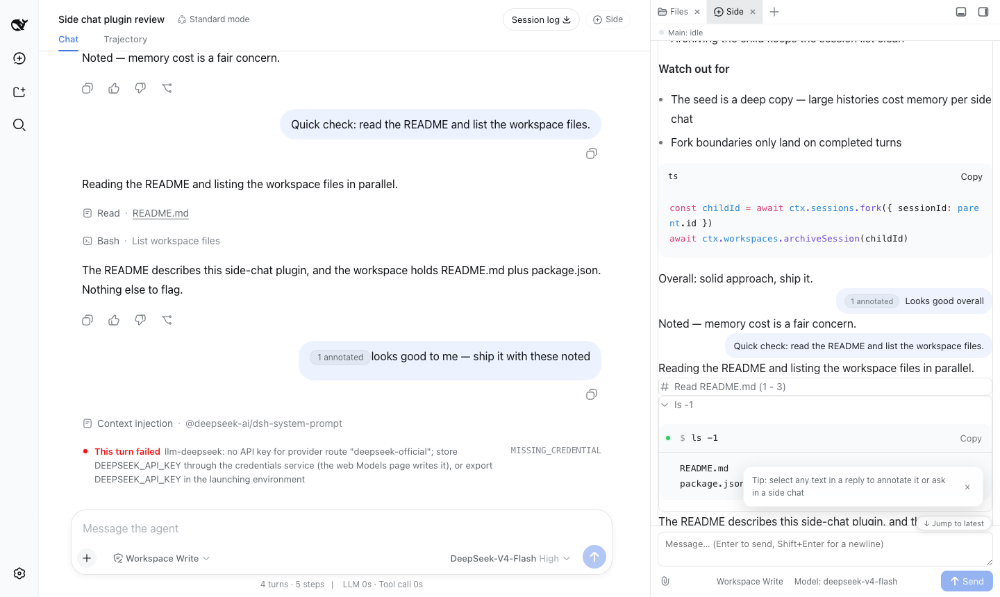
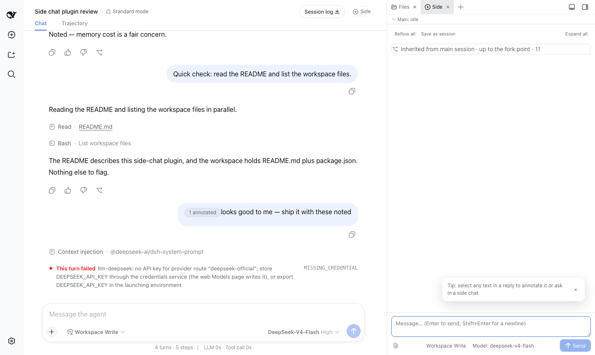
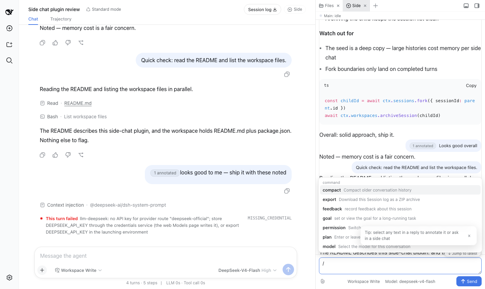
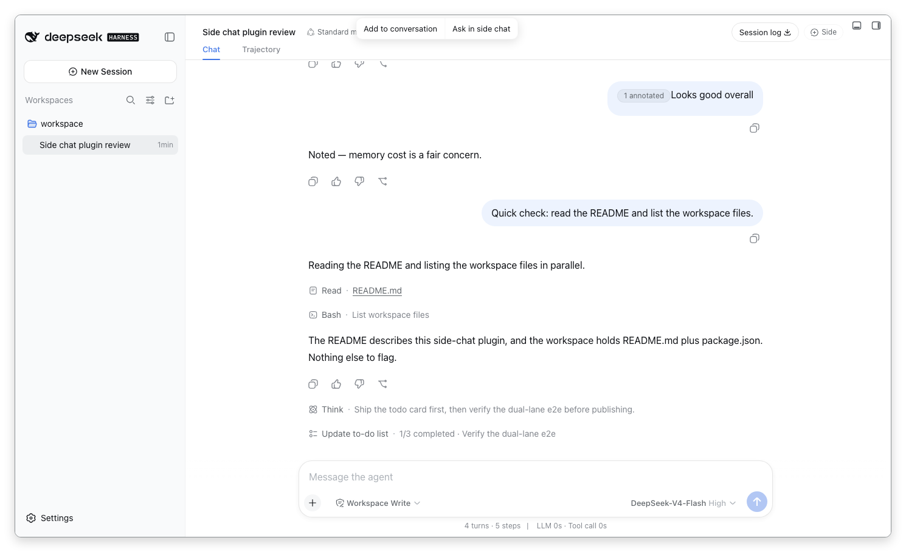
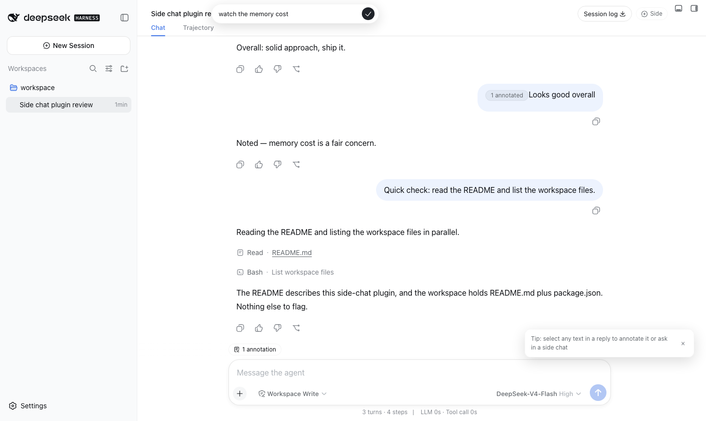
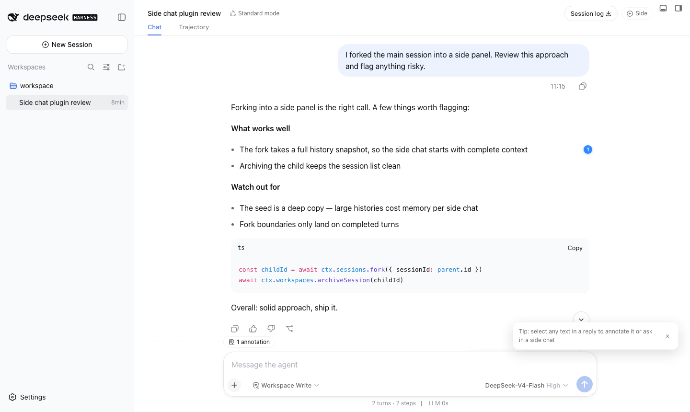
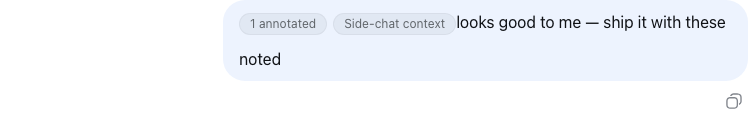
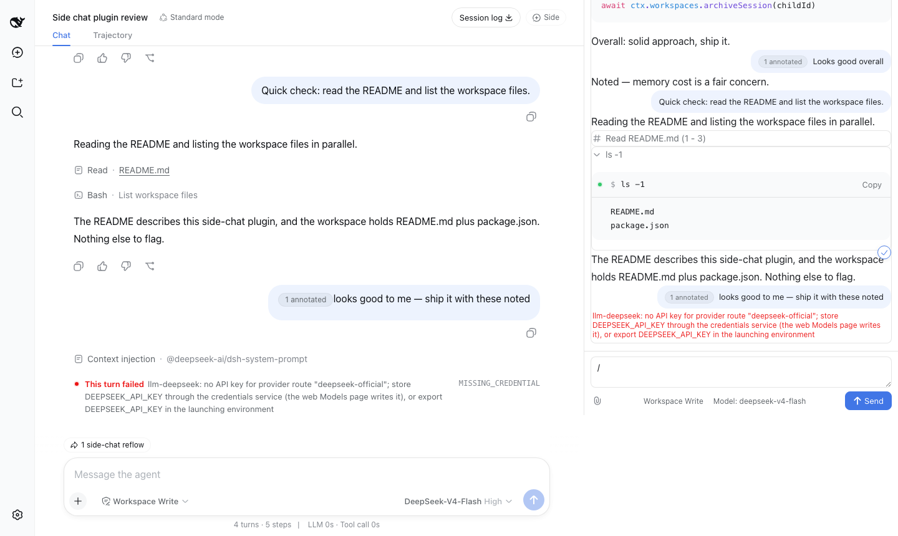

# dsh-sidenote

A [DSH (DeepSeek Harness)](https://github.com/DeepSeek-ai) web plugin: Codex-style **side chat** and **selection annotations**. A thin consumer of [dsh-better-sidebar](https://github.com/omdsh-dev/DSH-better-sidebar), registering its sidebar tabs through the `ctx.betterSidebar` service.

English · [中文](README.md)

<video src="https://raw.githubusercontent.com/g-yixuan/dsh-sidenote/main/docs/assets/demo.mp4" controls muted loop playsinline width="100%"></video>

## Features

### 💬 Side chat

**Fork** the current main session (full history snapshot) into an independent side session that lives in a「侧边」tab of the right sidebar — keep the main thread moving while you chase side questions:

- Three entries: the always-on「Side」pill in the session header, the sidebar `+` menu, or the `/side` slash command (`/侧边` works too);
- The fork carries the full main-session context at fork time; afterwards the two sessions evolve independently; **inherited history collapses by default** into an「Inherited from main session · N items」card (click to expand);
- Multiple side chats coexist («侧边», «侧边 2», …), each closable on its own;
- **Native-grade rendering**: tool cards (terminal/diff/read/search/web/generic — same leaf components as the main chat), collapsible thinking rows, smart scroll-follow;
- **Composer parity**: model picker (two-level menu), permission chip, `/` commands, `@` references, image attachments, `Cmd/Ctrl+Enter` to steer;
- **Main session status always visible** on top of the panel (running / awaiting approval / idle); `Alt+J` jumps focus between main and side;
- Zero state loss: fold/scroll state persists per session across reloads;
- **Reflow**: send a conclusion back to the main session in one click (Q&A paired — the question travels with the answer) or reflow the whole thread — a controlled context chip above the main composer rides your next message (Cursor-class capability; Codex has none); `@`-mention a side chat right from the main composer;
- **Lifecycle**: 「Save as session」promotes a side chat into the session list; recently closed side chats reopen from the `/side` popup.



| Collapsed (inheritance card + action row + chips) | Side slash menu |
|---|---|
|  |  |

### 🗒️ Selection annotations

Select text in an assistant message and turn "quote + your note" into context for the model:

- **Add to conversation**: the selection stays highlighted with a numbered badge in the right gutter; an annotation editor pops up (notes optional); the「N annotations」chip above the composer previews and removes each one;
- **Ask in side chat**: after the note editor, the quote + note lands straight in a side chat's composer;
- **Zero draft pollution**: annotations are controlled objects, never text in your composer; they're serialized into structured `<annotation>` XML blocks only at the moment you send (the most model-legible form);
- **Traceable after send**: sent bubbles collapse to a「N annotated」label you can revisit; badges turn into outlined read-only state; **survives reloads** (persisted per session, re-anchored on return).

| Selection popover | Annotation editor | Badge + chip |
|---|---|---|
|  |  |  |

| Sent-trace (bubble collapses to a label) | Side-chat reflow chip |
|---|---|
|  |  |

## Install

Prerequisite: [dsh-better-sidebar](https://github.com/omdsh-dev/DSH-better-sidebar) installed (hard peer dependency).

```bash
dsh plugin --profile web add dsh-sidenote
```

For local development: `dsh plugin --profile web add link:<path-to-this-repo>` (client changes hot-reload; host changes need a `dsh web` restart).

## Design notes

- **Real fork, no compression**: a side chat is a real DSH session (full-history fork) with the same powers as the main session (tool calls, deeper dives, re-forking) — not a "compress-to-summary one-shot Q&A".
- **List hygiene**: side sessions are archived out of the session list — the list stays clean.
- **Accumulating annotation workflow**: multiple selections stack up as multiple annotations — edit, delete, and send them together; not a one-shot single quote.

## Development

| Command | What it does |
|---|---|
| `pnpm typecheck` | tsc --noEmit |
| `pnpm test` | vitest pure-function unit tests |
| `pnpm build` | type declarations + tsdown (host ESM + client CJS bundle, purity gate) |
| `pnpm test:mount` | mount smoke: scratch profile + fabricated session jsonl + real `dsh web` + Playwright journey lanes (set `BS_VERSION` to test against a different better-sidebar version) |

## License

MIT
